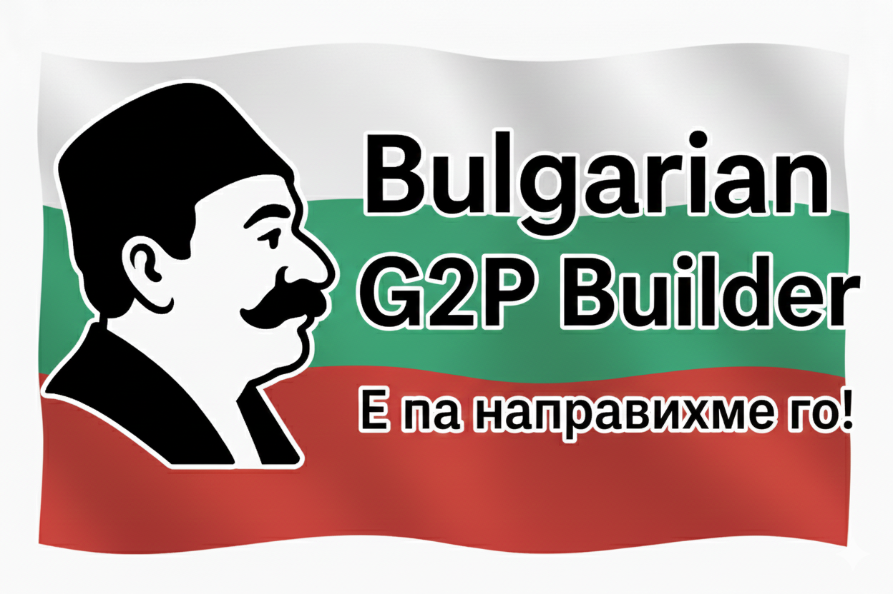

# 🇧🇬 Bulgarian G2P Dataset Builder



Този проект създава професионален речник за **Grapheme-to-Phoneme (G2P)**, необходим за трениране на модели за синтез на реч (TTS) на български език.

Създаден с ❤️ за българската Open-Source общност.

## 📖 Въведение

Този проект съдържа инструменти за създаване на висококачествен **G2P (Grapheme-to-Phoneme)** речник за български език.  
Целта е да се превърнат думите (напр. „вълна“) в фонетична транскрипция (IPA: `v ɤ ɫ n ˈ a`), използвана за трениране на модели за синтез на реч (TTS).

## 🎯 Защо ни трябва това?

Българският език има подвижно ударение и специфични правила за обеззвучаване, които стандартните инструменти често бъркат. Този набор от скриптове:

1. Извлича **проверени произношения** от Wiktionary.  
2. Извлича **ударения** от Читанка / Alpaca dataset.  
3. Използва `Espeak-NG` за генерация на липсващите транскрипции.  
4. **Поправя систематични грешки** на eSpeak-NG (напр. заменя `ə` с `ɤ` според академичния стандарт).  
5. Обработва **омографи** (думи с еднакъв правопис, но различно ударение: *въ̀лна* vs *вълна̀*).

## 👥 За кого е този проект?

Този речник е полезен ако:

- тренирате **TTS модел** за български език;  
- правите собствен **G2P модел** (напр. с Goruut, Phonetisaurus и др.);  
- искате **стабилна IPA база** за лингвистични експерименти или QA.

## 📚 Обяснение на източниците (и какво да правим, ако изчезнат)

Този проект разчита на два основни проекта. Ако те изчезнат, ето как да ги замените:

### 1. Wiktionary (Уикиречник)

- **Какво е:** Свободен речник, поддържан от доброволци. Най-ценното за нас в него са готовите IPA транскрипции.  
- **Как го ползваме:** Чрез проекта [Kaikki.org](https://kaikki.org/dictionary/Bulgarian/), който превръща Уикиречник в удобен JSONL формат.  
  - Линк към дъмпа: [Bulgarian JSONL](https://kaikki.org/dictionary/Bulgarian/jsonl/Bulgarian.jsonl.gz)

- **🆘 Ако линкът умре:**
    1. Посетете основния сайт [kaikki.org](https://kaikki.org).
    2. Намерете „Bulgarian“ и скролнете до секцията **Download**.
    3. Ако и там липсва файлът, потърсете „Wiktionary dump parse“ в GitHub или Google.  

### 2. Hugging Face Datasets (Chitanka/Alpaca)

- **Какво е:** Използваме библиотеката `datasets` на Hugging Face, за да свалим речник, изграден от материали на *Читанка*.  
  - Линк към набора от данни: [vislupus/alpaca-bulgarian-dictionary](https://huggingface.co/datasets/vislupus/alpaca-bulgarian-dictionary)

- **Защо:** Този речник съдържа думи с **ударения** (напр. `ръка` vs `ръка` -> `ръка'`). Без маркирано ударение eSpeak-NG често не може да познае правилното произношение.

- **🆘 Ако линкът умре:**
    1. Ние ползваме `vislupus/alpaca-bulgarian-dictionary`.  
    2. Ако го изтрият, потърсете "Chitanka words list", "Bulgarian spellcheck dictionary" или подобни.  
    3. Всеки текстов файл, в който думите имат ударения, ще свърши работа (трябва да промените само `step1`).  

---

## 🛠️ Изисквания

### 1. Python и нужни библиотеки

Изтеглете и инсталирайте **Python 3.10+**.  
Тествано с **Python 3.11+**.

Инсталирайте нужните пакети:

```bash
pip install requests tqdm datasets phonemizer
````

или:

```bash
pip install -r requirements.txt
```

### 2. Espeak-NG (Задължително!)

Това е „двигателят“, който генерира фонетиката.

- **Windows:** Свалете и инсталирайте [eSpeak-NG (MSI)](https://github.com/espeak-ng/espeak-ng/releases).

  - Запомнете пътя (напр. `C:\Program Files\eSpeak NG`) и го задайте в `step2_build_lexicon.py`, ако не бъде намерен.

- **Linux:**

```bash
sudo apt install espeak-ng
```

---

## 🚀 Как се използва (Стъпка по стъпка)

### Стъпка 1: Клониране

```bash
git clone https://github.com/actepukc/bg_g2p_builder.git
cd bg_g2p_builder
```

или свалете ZIP и го разархивирайте.

### Стъпка 2: Сваляне на ресурсите

```bash
python step1_download_sources.py
```

Това ще създаде папка `output/` и ще запише в нея:

- `bg_kaikki.jsonl`
- `dictionary_with_stress.tsv`

Всеки следващ скрипт проверява дали предишните са изпълнени и показва ясно съобщение, ако липсва нужният файл.

### Стъпка 3: Генерация и сливане

```bash
python step2_build_lexicon.py
```

### Стъпка 4: Финализиране

```bash
python step3_polish_lexicon.py
```

🎉 Готово — финалният файл е **`lexicon.tsv`**.

---

## 📄 Формат на `lexicon.tsv`

Файлът е таб-разделен с две колони:

1. **word** – дума в правописна форма
2. **ipa** – IPA транскрипция, разделена с интервали

Пример:

```tsv
дума<TAB>d u m a
```

```tsv
вълна    v ɐ ɫ n ˈ a
въ̀лна    ˈ v ɤ ɫ n ɐ
щерян    ʃ t ɛ r ˈ j a n
```

---

## 📚 Източници и Лицензи

- **Wiktionary Data:** [Kaikki.org](https://kaikki.org/) — лиценз CC-BY-SA.
- **Stress Data:** [vislupus/alpaca-bulgarian-dictionary](https://huggingface.co/datasets/vislupus/alpaca-bulgarian-dictionary) — важат лицензите на dataset-а.
- **IPA нормализация:** Фонетични правила: Базирани на съвременните академични стандарти за български IPA.

Ако ползвате генерирания речник в свой проект, уверете се, че спазвате условията на всички източници.

---

## ❓ Защо съществува този проект?

Проектът е създаден след работа върху обогатяване на датасета за [goruut/dataset](https://github.com/neurlang/dataset) и нуждата от стабилен, публичен и автоматично поддържан български G2P речник.
